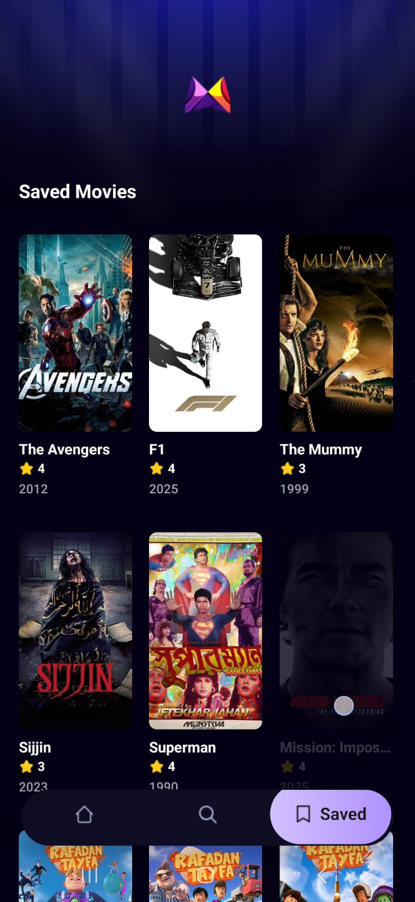
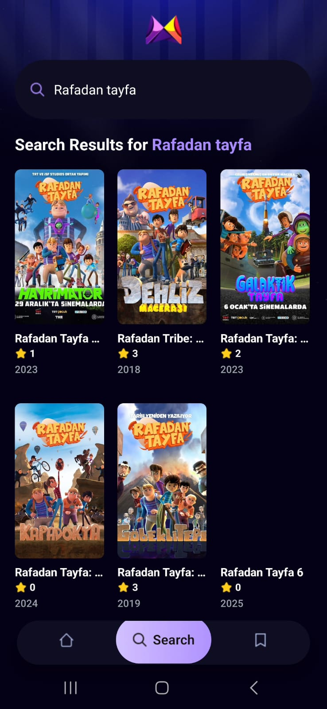
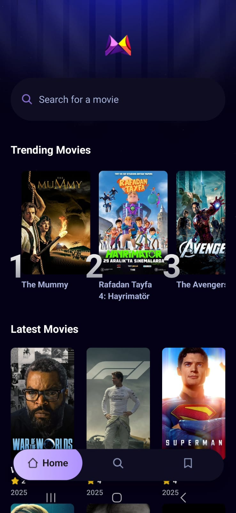

# 🎬 MovieFlix

<div align="center">


**A modern movie discovery app built with React Native and Expo**

[](https://expo.dev/)
[](https://reactnative.dev/)
[](https://www.typescriptlang.org/)
[](https://appwrite.io/)

</div>

## 📱 Screenshots

<div align="center">
  
  
  
  
</div>

## ✨ Features

- 🎯 **Trending Movies**: Discover popular movies based on user search analytics
- 🔍 **Smart Search**: Search for movies with real-time results from TMDB API
- 💾 **Save Movies**: Bookmark your favorite movies for later viewing
- 📊 **Detailed Information**: View comprehensive movie details including cast, ratings, and reviews
- 📈 **Analytics-Driven Trends**: Algorithm that determines trending movies based on search frequency
- 🎨 **Modern UI**: Clean and intuitive interface built with NativeWind (Tailwind CSS)
- 📱 **Cross-Platform**: Works seamlessly on both iOS and Android

## 🛠️ Tech Stack

| Technology       | Purpose                                                   |
| ---------------- | --------------------------------------------------------- |
| **Expo**         | React Native framework for cross-platform development     |
| **React Native** | Mobile app development framework                          |
| **TypeScript**   | Type-safe JavaScript development                          |
| **Appwrite**     | Backend-as-a-Service for data storage and user management |
| **TMDB API**     | Movie database for fetching movie information             |
| **NativeWind**   | Tailwind CSS for React Native styling                     |
| **Expo Router**  | File-based routing for navigation                         |

## 🏗️ Architecture

```
movie-flix/
├── app/                    # App screens and navigation
│   ├── (tabs)/            # Tab-based navigation
│   │   ├── index.tsx      # Home/Trending screen
│   │   ├── search.tsx     # Search screen
│   │   ├── saved.tsx      # Saved movies screen
│   │   └── profile.tsx    # User profile screen
│   ├── movies/            # Movie-specific screens
│   │   └── [id].tsx       # Movie details screen
│   └── _layout.tsx        # Root layout
├── components/            # Reusable UI components
│   ├── movie-card.tsx     # Movie card component
│   ├── search-bar.tsx     # Search input component
│   └── trending-card.tsx  # Trending movie card
├── services/              # API and backend services
│   ├── api.ts            # TMDB API integration
│   ├── appwrite.ts       # Appwrite backend functions
│   └── useFetch.ts       # Custom fetch hook
├── constants/             # App constants
├── interfaces/            # TypeScript interfaces
└── assets/               # Static assets
```

## 🚀 Getting Started

### Prerequisites

- Node.js (v16 or higher)
- npm or yarn
- Expo CLI
- iOS Simulator (for iOS development)
- Android Studio (for Android development)

### Installation

1. **Clone the repository**

   ```bash
   git clone https://github.com/mr-isik/movie-flix.git
   cd movie-app
   ```

2. **Install dependencies**

   ```bash
   npm install
   ```

3. **Set up environment variables**

   Create a `.env` file in the root directory:

   ```env
   EXPO_PUBLIC_TMDB_API_KEY=your_tmdb_api_key
   EXPO_PUBLIC_APPWRITE_ENDPOINT=your_appwrite_endpoint
   EXPO_PUBLIC_APPWRITE_PROJECT_ID=your_appwrite_project_id
   EXPO_PUBLIC_APPWRITE_DB_ID=your_database_id
   ```

4. **Start the development server**

   ```bash
   npx expo start
   ```

5. **Run on your device**
   - Download Expo Go app on your mobile device
   - Scan the QR code from the terminal
   - Or press `i` for iOS simulator, `a` for Android emulator

## ⚙️ Configuration

### TMDB API Setup

1. Create an account at [TMDB](https://www.themoviedb.org/)
2. Go to Settings → API → Create API Key
3. Add your API key to the `.env` file

### Appwrite Setup

1. Create an account at [Appwrite](https://appwrite.io/)
2. Create a new project
3. Set up the following collections in your database:
   - `metrics` - For tracking search analytics
   - `saved` - For storing saved movies
4. Add your Appwrite credentials to the `.env` file

## 🎯 Key Features Explained

### Trending Algorithm

The app implements a sophisticated trending algorithm that:

- Tracks user search queries and frequency
- Analyzes movie interaction patterns
- Ranks movies based on search volume and engagement
- Updates trending lists in real-time

### Search Analytics

- Records every search query with movie interactions
- Maintains search count metrics per movie
- Provides insights into user preferences
- Powers the trending movies algorithm

### Movie Management

- Save/unsave movies with visual feedback
- Persistent storage using Appwrite database
- Real-time synchronization across devices
- Optimistic UI updates for better UX

## 📱 Usage

1. **Discover Movies**: Browse trending movies on the home screen
2. **Search**: Use the search tab to find specific movies
3. **Save Movies**: Tap the save button on any movie to bookmark it
4. **View Details**: Tap on any movie card to see detailed information
5. **Manage Saved**: Access your saved movies from the saved tab

## 🔧 Scripts

```bash
# Start development server
npm start

# Start with clear cache
npm run start:clear

# Build for production
npm run build

# Run on iOS
npm run ios

# Run on Android
npm run android

# Type checking
npm run type-check

# Linting
npm run lint
```

## 🤝 Contributing

Contributions are welcome! Please feel free to submit a Pull Request.

1. Fork the project
2. Create your feature branch (`git checkout -b feature/AmazingFeature`)
3. Commit your changes (`git commit -m 'Add some AmazingFeature'`)
4. Push to the branch (`git push origin feature/AmazingFeature`)
5. Open a Pull Request

## 📄 License

This project is licensed under the MIT License - see the [LICENSE](LICENSE) file for details.

## 🙏 Acknowledgments

- [TMDB](https://www.themoviedb.org/) for providing the movie database API
- [Appwrite](https://appwrite.io/) for the backend infrastructure
- [Expo](https://expo.dev/) for the amazing development platform
- [NativeWind](https://nativewind.dev/) for bringing Tailwind CSS to React Native

## 📞 Contact

**Ömer Faruk Işık** - [@mr-isik](https://github.com/mr-isik)

Project Link: [https://github.com/mr-isik/movie-app](https://github.com/mr-isik/movie-flix)

---

<div align="center">
  Made with ❤️ using React Native and Expo
</div>
